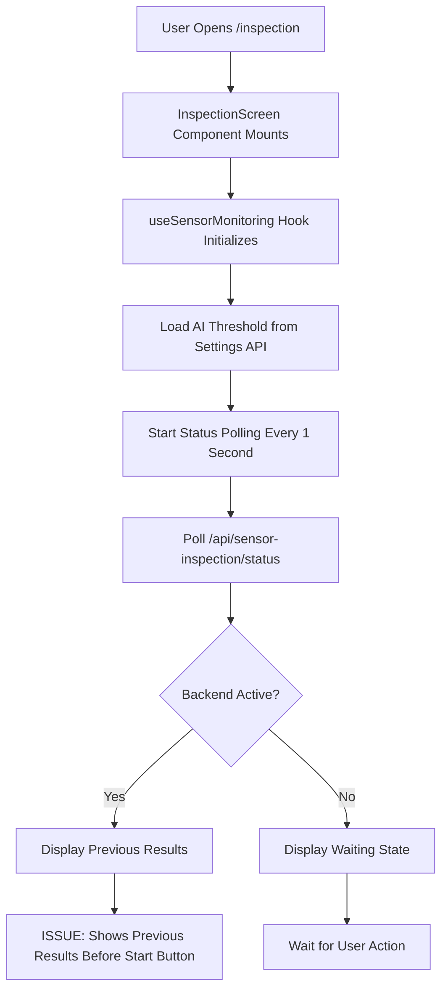
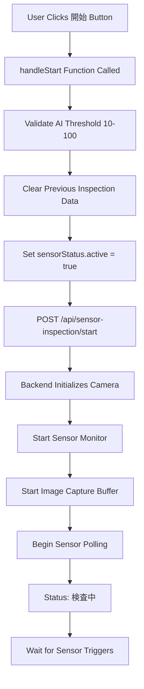
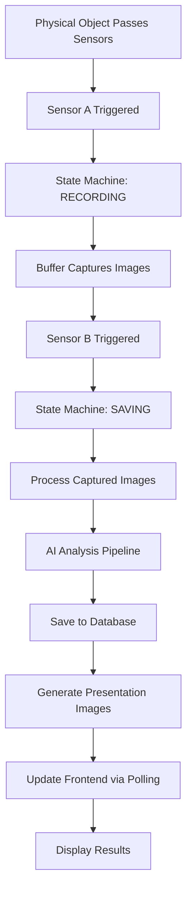
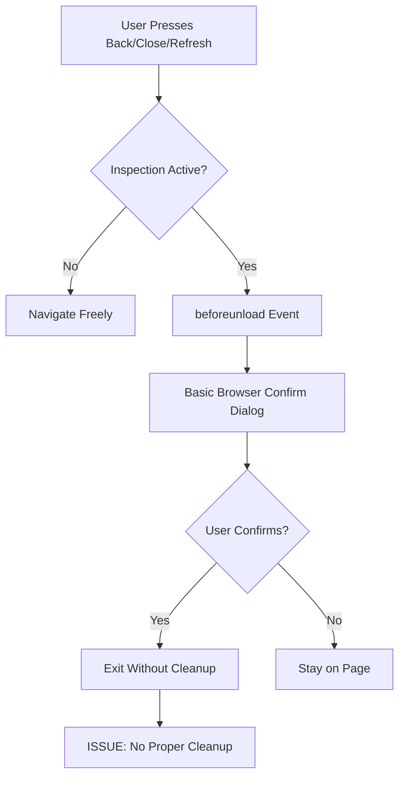

# Current Inspection Processing Flow Analysis

## Overview

This document analyzes the current inspection processing workflow in the wood inspection system, identifying the flow from user interaction to result display, highlighting areas that need improvement for abnormal case handling.

## System Architecture Components

### Frontend Components
- **InspectionScreen.tsx**: Main inspection interface container
- **ControlPanel**: Start/Stop/Settings controls
- **InspectionDisplay**: Result and image display area
- **useSensorMonitoring**: Sensor control and monitoring hook
- **useInspectionState**: Inspection data and image management hook
- **useSensorData**: Real-time data processing hook

### Backend Components  
- **sensor_inspection.py**: Main inspection API endpoints
- **SensorMonitor**: Hardware sensor monitoring service
- **SensorTriggeredCapture**: Image capture and processing service
- **Camera Integration**: Basler/USB/Webcam camera handling
- **Database Layer**: PostgreSQL with inspection result storage

## Current Processing Flow

### 1. Application Startup Flow



**Current Issues**:
- **Issue ①**: Status polling starts immediately on component mount, showing previous results
- No distinction between "system available" and "inspection active" states
- Previous inspection data persists across navigation

### 2. Inspection Start Flow



**Current Issues**:
- **Issue ②**: No multi-tab protection - multiple tabs can start simultaneously
- No session locking mechanism
- Concurrent access can cause resource conflicts

### 3. Sensor Detection and Processing Flow



**Current Processing States**:
- **待機中**: System idle, waiting for sensor input
- **検査中**: Sensors active, monitoring for objects  
- **処理中**: Object detected, processing images
- **完了**: Results available for display

### 4. Browser Navigation Current Flow



**Current Issues**:
- **Issue ③**: No inspection-aware navigation protection
- Basic `beforeunload` handling insufficient for inspection process
- No proper cleanup when exiting during inspection
- No custom confirmation dialogs based on inspection state

## Data Flow Analysis

### 1. Real-time Data Sources

```
┌─────────────────────────────────────────────────────────────┐
│ Frontend Data Flow (Every 1 Second)                        │
├─────────────────────────────────────────────────────────────┤
│                                                             │
│ useSensorMonitoring Hook                                    │
│        ↓                                                    │
│ GET /api/sensor-inspection/status                           │
│        ↓                                                    │
│ Backend Sensor Status Response                              │
│        ↓                                                    │
│ Update sensorStatus State                                   │
│        ↓                                                    │
│ Trigger Component Re-renders                                │
│        ↓                                                    │
│ Update UI (Status, Results, Images)                         │
└─────────────────────────────────────────────────────────────┘
```

### 2. Database-First Architecture

```
┌─────────────────────────────────────────────────────────────┐
│ Database-First Data Flow                                    │
├─────────────────────────────────────────────────────────────┤
│                                                             │
│ Inspection Results → PostgreSQL                             │
│        ↓                                                    │
│ API: /api/inspections/result?inspection_id=X                │
│        ↓                                                    │
│ useSensorData.fetchInspectionResult()                       │
│        ↓                                                    │
│ Process Result Data (knot classification)                   │
│        ↓                                                    │
│ Update batchResult & defectType                             │
│        ↓                                                    │
│ ResultDisplay & InspectionDisplay                           │
└─────────────────────────────────────────────────────────────┘
```

### 3. Image Processing Pipeline

```
┌─────────────────────────────────────────────────────────────┐
│ Presentation Images Flow                                    │
├─────────────────────────────────────────────────────────────┤
│                                                             │
│ Sensor Trigger → Image Capture                              │
│        ↓                                                    │
│ AI Analysis → Defect Detection                              │
│        ↓                                                    │
│ Generate Presentation Images (Groups A-E)                   │
│        ↓                                                    │
│ Store in Database & File System                             │
│        ↓                                                    │
│ Frontend Polling for Images                                 │
│        ↓                                                    │
│ PresentationImagesGrid Display                              │
└─────────────────────────────────────────────────────────────┘
```

## State Management Architecture

### 1. Hook Responsibilities

| Hook | Responsibility | Data Source | Update Frequency |
|------|---------------|-------------|------------------|
| `useSensorMonitoring` | Sensor control, AI threshold, start/stop | `/api/sensor-inspection/status` | 1 second |
| `useInspectionState` | Inspection results, presentation images | `/api/inspections/*` | Event-driven |
| `useSensorData` | Real-time sensor data, batch processing | `/api/sensor-inspection/status` | 1 second |
| `useCameraManagement` | Camera preview, connection status | `/api/camera/*` | Variable |

### 2. Global State (Window Objects)

The system uses several global window objects for cross-component communication:

```javascript
// Global functions exposed on window
window.sensorStatus = sensorStatus;
window.updateInspectionResultFromSensorStatus = function;
window.updateStatus = function;
window.clearInspectionResults = function;
window.loadPresentationImages = function;
window.fetchInspectionResults = function;
```

**Issues with Current Global State**:
- No tab instance isolation
- Shared global state across multiple tabs
- Potential race conditions between tabs

## Current Issues Deep Dive

### Issue ① - Automatic Sensor Watching

**Problem Location**: `useSensorMonitoring.ts` lines 238-272

```typescript
// Current problematic code
useEffect(() => {
  // Starts polling immediately on component mount
  pollSensorStatus();
  sensorStatusRef.current = setInterval(pollSensorStatus, 1000);
  
  return () => {
    if (sensorStatusRef.current) {
      clearInterval(sensorStatusRef.current);
    }
  };
}, []); // Empty dependency - runs on mount
```

**Impact**:
- Shows previous inspection results when navigating back
- Confuses users about inspection state
- No clear distinction between "available" and "active" states

### Issue ② - No Multi-Tab Protection  

**Problem**: No session management or process locking

**Current Vulnerable Flow**:
1. Tab A starts inspection → Backend active
2. Tab B opens → Shows Tab A's results  
3. Tab B tries to start → Backend allows (should reject)
4. Both tabs competing for same resources

**Missing Components**:
- Tab instance identification
- Backend process locking
- Cross-tab communication
- Session state management

### Issue ③ - Insufficient Navigation Protection

**Current Limited Protection**:

```typescript
// main-provider.tsx - Basic beforeunload
const handleBeforeUnload = (event: BeforeUnloadEvent) => {
  if (blocking) {
    const message = '保存されていない変更があります。本当に移動しますか？';
    event.returnValue = message;
    return message;
  }
};

// Commented out popstate handling
// const handlePopState = (event: PopStateEvent) => { ... }
```

**Missing Features**:
- Inspection state-aware blocking
- Custom confirmation dialogs
- Different messages for different inspection phases  
- Proper cleanup procedures

## Performance Characteristics

### Current Polling Behavior
- **Frequency**: 1 second intervals
- **Multiple Tabs**: Each tab polls independently 
- **Network Load**: High with multiple tabs open
- **CPU Usage**: Continuous JavaScript execution

### Resource Usage Analysis
```
Single Tab:
- 1 request/second to status endpoint
- Continuous React re-renders
- Memory: ~50-100MB baseline

Multiple Tabs (3 tabs):
- 3 requests/second total
- 3x React rendering overhead  
- Memory: ~150-300MB total
- Potential backend resource conflicts
```

## Integration Points with External Systems

### 1. Hardware Integration
- **Basler Camera**: Direct hardware API calls
- **Sensor Hardware**: Physical I/O monitoring
- **DIO Device**: Digital input/output for triggers

### 2. Database Integration
- **PostgreSQL**: Primary data storage
- **Tables**: t_inspection, t_inspection_result, t_inspection_presentation
- **API Layer**: FastAPI with SQLAlchemy ORM

### 3. File System Integration
- **Image Storage**: Local file system in `data/images/inspection/`
- **Configuration**: YAML/INI files for system settings
- **Logs**: Application and debug logging

## Error Scenarios and Current Handling

### 1. Network Failures
- **Current**: Basic error logging, continues polling
- **Issue**: No graceful degradation or user feedback

### 2. Hardware Failures  
- **Current**: Camera fallback to simulation mode
- **Issue**: No inspection process state recovery

### 3. Browser Crashes
- **Current**: No session recovery
- **Issue**: Lost inspection state, potential resource locks

### 4. Database Failures
- **Current**: API errors logged
- **Issue**: No fallback data sources or user guidance

## Recommendations Summary

Based on this analysis, the system needs:

1. **Controlled Sensor Monitoring**: Only poll when inspection is actively started
2. **Session Management**: Tab-aware session handling with process locking  
3. **Navigation Protection**: Inspection state-aware navigation guards
4. **Improved Error Handling**: Graceful failure handling and recovery
5. **Performance Optimization**: Reduce polling overhead with multiple tabs
6. **State Persistence**: Proper state management across navigation events

The current system works well for single-user, single-tab scenarios but lacks the robustness needed for production use with multiple concurrent sessions and proper abnormal case handling.