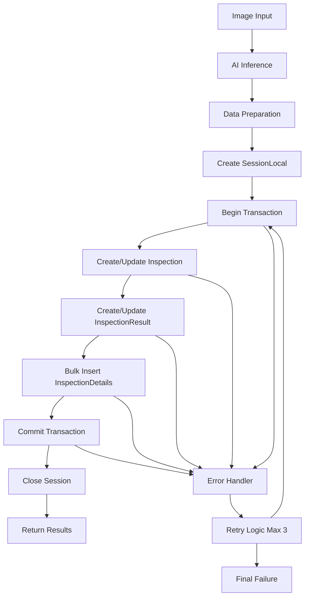
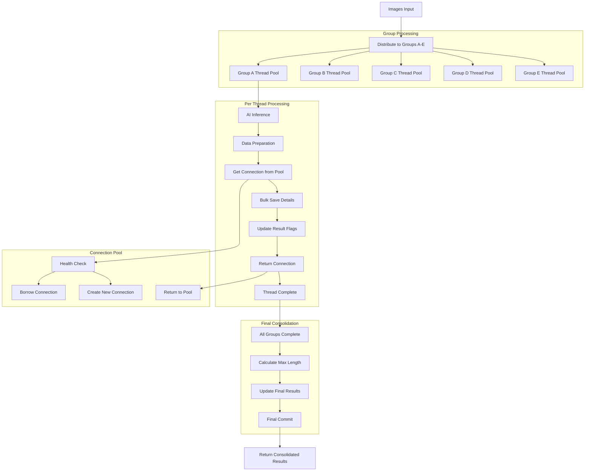

# Database Saving Patterns Analysis

## Table of Contents

1. [Overview](#overview)
2. [Analysis Folder Database Saving Logic](#analysis-folder-database-saving-logic)
3. [Parallel Folder Database Saving Logic](#parallel-folder-database-saving-logic)
4. [Detailed Comparison](#detailed-comparison)
5. [Data Flow Diagrams](#data-flow-diagrams)
6. [Performance Analysis](#performance-analysis)
7. [Error Handling and Recovery](#error-handling-and-recovery)
8. [Best Practices and Recommendations](#best-practices-and-recommendations)

## Overview

This document provides a comprehensive analysis of database saving patterns used in the wood inspection system across two different architectures:

- **Analysis Folder**: Single-threaded sequential processing approach
- **Parallel Folder**: Multi-threaded parallel processing approach with connection pooling

Both approaches handle the saving of inspection data, defect details, and measurement results to the database, but use fundamentally different strategies for performance optimization and error handling.

## Analysis Folder Database Saving Logic

### Architecture Overview

The analysis folder implements a **synchronous, single-threaded approach** where each image is processed sequentially and database operations are performed immediately after inference.

### Key Components

#### 1. ImageAnalyzer Class
- **Location**: `src-api/source/camera/basler/analysis/image_analyzer.py`
- **Purpose**: Handles image analysis and immediate database operations
- **Database Dependencies**: Direct use of `SessionLocal()` from SQLAlchemy

#### 2. LengthCalculator Class
- **Location**: `src-api/source/camera/basler/analysis/length_calculator.py`
- **Purpose**: Calculates physical dimensions of defects using configurable resolution settings
- **Database Impact**: Provides calculated measurements for storage

### Database Saving Process

#### Step-by-Step Logic

```python
def analyze_image(self, image_path: str, shared_inspection_id: int = None) -> Dict[str, Any]:
    """
    Complete database saving process for a single image
    """
    
    # 1. AI INFERENCE PHASE
    inference_results = self.camera.inference_service.predict_image(image_path)
    
    # 2. DATA PREPARATION PHASE
    # - Filter detections by confidence threshold
    # - Calculate physical dimensions using LengthCalculator
    # - Map detection classes to Japanese names
    # - Extract image metadata (image number from filename)
    
    # 3. DATABASE TRANSACTION PHASE
    max_retries = 3
    for retry in range(max_retries):
        try:
            with SessionLocal() as session:
                session.begin()  # Start transaction
                
                # 3a. INSPECTION RECORD MANAGEMENT
                if shared_inspection_id:
                    # Update existing inspection
                    inspection = session.query(Inspection).get(shared_inspection_id)
                    # Update status and results if needed
                else:
                    # Create new inspection
                    inspection = Inspection(
                        ai_threshold=self.camera.ai_threshold,
                        inspection_dt=datetime.now(),
                        file_path=os.path.dirname(image_path),
                        status=confidence_above_threshold,
                        results=inspection_result
                    )
                    session.add(inspection)
                    session.flush()  # Get inspection_id
                
                # 3b. INSPECTION RESULT MANAGEMENT
                inspection_result_record = session.query(InspectionResult).filter(
                    InspectionResult.inspection_id == inspection_id
                ).first()
                
                if not inspection_result_record:
                    # Create new InspectionResult
                    inspection_result_record = InspectionResult(
                        inspection_id=inspection_id,
                        length=max_length if filtered_detections else 0.0,
                        **result_flags  # discoloration, hole, knot, etc.
                    )
                    session.add(inspection_result_record)
                else:
                    # Update existing flags and length
                    for flag, value in result_flags.items():
                        if value:
                            setattr(inspection_result_record, flag, True)
                    
                    # Length update logic with NULL prevention
                    if inspection_result_record.length is None:
                        inspection_result_record.length = max_length if max_length > 0 else 0.0
                    elif max_length > inspection_result_record.length:
                        inspection_result_record.length = max_length
                
                # 3c. BULK INSERT INSPECTION DETAILS
                if inspection_details:
                    detail_objects = [
                        InspectionDetails(
                            inspection_id=inspection_id,
                            **detail_data
                        ) for detail_data in inspection_details
                    ]
                    session.bulk_save_objects(detail_objects)
                
                # 3d. COMMIT ALL CHANGES
                session.commit()
                break  # Success - exit retry loop
                
        except Exception as db_error:
            logger.error(f"Database error (attempt {retry+1}/{max_retries}): {db_error}")
            if retry == max_retries - 1:
                raise  # Re-raise on last attempt
            time.sleep(0.2)  # Brief delay before retry
```

#### Data Structures Saved

1. **Inspection Table**
   ```python
   inspection = Inspection(
       ai_threshold=50,           # AI confidence threshold used
       inspection_dt=datetime.now(),  # Timestamp
       file_path="/path/to/images",   # Directory path
       status=True,               # Whether defects found above threshold
       results="節あり"           # Classification result
   )
   ```

2. **InspectionResult Table**
   ```python
   inspection_result = InspectionResult(
       inspection_id=12345,       # Foreign key to inspection
       length=15.5,              # Maximum defect length in mm
       discoloration=False,      # Boolean flags for defect types
       hole=False,
       knot=True,
       dead_knot=True,
       live_knot=False,
       tight_knot=False
   )
   ```

3. **InspectionDetails Table** (Bulk Insert)
   ```python
   inspection_details = [
       InspectionDetails(
           inspection_id=12345,
           error_type=2,              # Class ID (0-5)
           error_type_name="死に節",   # Japanese classification
           x_position=100.0,          # Bounding box coordinates
           y_position=150.0,
           x2_position=200.0,
           y2_position=250.0,
           width=100.0,              # Calculated dimensions
           height=100.0,
           length=12.5,              # Physical length in mm
           confidence=0.85,          # AI confidence score
           image_path="/full/path/No_0001.bmp",
           image_no=1               # Extracted from filename
       ),
       # ... more details for each detection
   ]
   ```

#### Transaction Characteristics

- **Atomicity**: All operations (inspection, result, details) in single transaction
- **Consistency**: Validation and NULL prevention for length values
- **Isolation**: Sequential processing prevents concurrent access issues
- **Durability**: Immediate commit ensures data persistence

## Parallel Folder Database Saving Logic

### Architecture Overview

The parallel folder implements a **distributed, multi-threaded approach** with connection pooling and eventual consistency through final consolidation.

### Key Components

#### 1. DatabaseConnectionPool Class
- **Location**: `src-api/source/camera/basler/parallel/database_connection_pool.py`
- **Purpose**: Manages thread-safe database connections (5-10 connections)
- **Features**: Health checking, automatic recovery, exponential backoff

#### 2. ParallelImageAnalyzer Class
- **Location**: `src-api/source/camera/basler/parallel/parallel_image_analyzer.py`
- **Purpose**: Thread-safe image analysis with connection pool integration
- **Database Strategy**: Immediate saving per thread + final consolidation

#### 3. ParallelProcessingManager Class
- **Location**: `src-api/source/camera/basler/parallel/parallel_processing_manager.py`
- **Purpose**: Orchestrates parallel processing and final result consolidation

### Database Saving Process

#### Phase 1: Parallel Processing Per Group

```python
class ParallelImageAnalyzer:
    def analyze_image_parallel(self, image_path: str, shared_inspection_id: int, group_name: str):
        """
        Thread-safe analysis and database saving
        """
        
        # 1. AI INFERENCE (Same as analysis folder)
        inference_results = self.camera.inference_service.predict_image(image_path)
        
        # 2. DATA PREPARATION (Same as analysis folder)
        # - Filter detections, calculate dimensions, prepare objects
        
        # 3. PARALLEL DATABASE OPERATIONS
        success = self._save_analysis_results_parallel(
            shared_inspection_id, 
            inspection_details, 
            result_flags, 
            max_length, 
            inspection_result
        )
        
    def _save_analysis_results_parallel(self, inspection_id, details, flags, max_length, result):
        """
        Thread-safe database operations using connection pool
        """
        
        # 3a. BULK SAVE INSPECTION DETAILS
        if inspection_details:
            success = self.db_pool.bulk_save_inspection_details(inspection_details)
        
        # 3b. UPDATE INSPECTION RESULT (with connection pool)
        def update_inspection_result(session, inspection_id, flags, max_length):
            result = session.query(InspectionResult).filter_by(inspection_id=inspection_id).first()
            
            if result:
                # Thread-safe flag updates (OR operation preserves existing True values)
                for flag_name, flag_value in flags.items():
                    if flag_value:
                        setattr(result, flag_name, True)
                
                # Thread-safe length updates (only increase, never decrease)
                if result.length is None:
                    result.length = max_length if max_length > 0 else 0.0
                elif max_length > 0 and max_length > result.length:
                    result.length = max_length
            
            session.commit()
        
        # Execute with retry logic and connection pooling
        return self.db_pool.execute_with_retry(update_inspection_result, inspection_id, flags, max_length)
```

#### Phase 2: Connection Pool Operations

```python
class DatabaseConnectionPool:
    def bulk_save_inspection_details(self, inspection_details: List[InspectionDetails]) -> bool:
        """
        Thread-safe bulk operations with retry logic
        """
        
        for attempt in range(self.max_retries):
            try:
                with self.get_connection() as session:  # Get from pool
                    session.bulk_save_objects(inspection_details)
                    session.commit()
                    logger.debug(f"Bulk saved {len(inspection_details)} inspection details")
                    return True
                    
            except Exception as e:
                logger.warning(f"Bulk save attempt {attempt + 1} failed: {e}")
                if attempt < self.max_retries - 1:
                    delay = self.retry_delay * (2 ** attempt)  # Exponential backoff
                    time.sleep(delay)
        
        return False
    
    @contextmanager
    def get_connection(self, timeout: float = 5.0):
        """
        Thread-safe connection management with health checking
        """
        session = None
        try:
            session = self._borrow_connection(timeout)
            if session and self._health_check(session):
                yield session
            else:
                session = self._create_new_connection()
                yield session
        except Exception as e:
            if session:
                self._invalidate_connection(session)
            raise
        finally:
            if session:
                self._return_connection(session)
```

#### Phase 3: Final Consolidation

```python
class ParallelProcessingManager:
    def _save_consolidated_length(self, inspection_id: int, max_length: float, inspection_result: str) -> bool:
        """
        Final consolidation after all parallel processing completes
        """
        
        # Validate and sanitize max_length
        if max_length is not None and isinstance(max_length, (int, float)):
            if max_length < 0:
                max_length = 0.0  # Fix negative values
            elif max_length > 100:
                max_length = 100.0  # Cap extremely large values
        else:
            max_length = 0.0  # Default for invalid types
        
        def update_consolidated_result(session, inspection_id, max_length, inspection_result):
            # Update InspectionResult with final consolidated values
            result = session.query(InspectionResult).filter_by(inspection_id=inspection_id).first()
            if result:
                result.length = max_length  # Final maximum from all threads
                logger.info(f"Updated consolidated length to {max_length}mm for inspection {inspection_id}")
            
            # Update Inspection with final classification
            inspection = session.query(Inspection).filter_by(inspection_id=inspection_id).first()
            if inspection:
                inspection.results = inspection_result
            
            session.commit()
            return True
        
        # Execute consolidation with retry logic
        return self.db_pool.execute_with_retry(update_consolidated_result, inspection_id, max_length, inspection_result)
```

#### Processing Group Coordination

```python
class ProcessingGroup:
    def process_group(self, shared_inspection_id: int, db_pool: DatabaseConnectionPool, results_manager) -> Dict[str, Any]:
        """
        Process multiple images in parallel within a group (A, B, C, D, E)
        """
        
        # Create analyzer for this group
        analyzer = ParallelImageAnalyzer(camera_instance=results_manager.camera, db_pool=db_pool)
        
        # Process images in parallel using ThreadPoolExecutor
        with ThreadPoolExecutor(max_workers=self.thread_pool_size) as executor:
            
            # Submit all image processing tasks
            future_to_image = {
                executor.submit(analyzer.analyze_image_parallel, image_path, shared_inspection_id, self.group_name): image_path 
                for image_path in self.image_paths
            }
            
            # Collect results as they complete
            for future in as_completed(future_to_image):
                try:
                    result = future.result()
                    if result:
                        self.results.append(result)
                        self.successful_images += 1
                    else:
                        self.failed_images += 1
                except Exception as e:
                    self.failed_images += 1
                    logger.error(f"Group {self.group_name} error: {e}")
        
        return self._prepare_group_result(shared_inspection_id, analyzer)
```

## Detailed Comparison

### Database Connection Management

| Aspect | Analysis Folder | Parallel Folder |
|--------|----------------|-----------------|
| **Connection Strategy** | New `SessionLocal()` per image | Connection pool (5-10 reused connections) |
| **Thread Safety** | Single-threaded (no concurrency) | Thread-safe with locks and health checks |
| **Connection Lifecycle** | Create → Use → Close | Borrow → Use → Return to pool |
| **Health Monitoring** | None | Automatic health checks with recovery |
| **Resource Efficiency** | High overhead (new connection each time) | Low overhead (connection reuse) |

### Transaction Management

| Aspect | Analysis Folder | Parallel Folder |
|--------|----------------|-----------------|
| **Transaction Scope** | Single large transaction per image | Multiple small transactions + consolidation |
| **Atomicity** | All operations atomic per image | Per-thread atomic + eventual consistency |
| **Isolation Level** | Default (READ_COMMITTED) | Default with connection pooling |
| **Rollback Strategy** | Full rollback per image | Partial rollback with retry |

### Data Consistency Approach

#### Analysis Folder: Immediate Consistency
```python
# Single transaction ensures immediate consistency
with SessionLocal() as session:
    session.begin()
    
    # All operations in single transaction
    create_inspection()
    update_inspection_result() 
    bulk_insert_details()
    
    session.commit()  # All or nothing
```

#### Parallel Folder: Eventual Consistency
```python
# Phase 1: Parallel updates (may have temporary inconsistencies)
for each_thread:
    with connection_pool.get_connection() as session:
        bulk_save_details()
        update_result_flags()  # Incremental updates
        session.commit()

# Phase 2: Final consolidation (ensures final consistency)
with SessionLocal() as session:
    update_final_length()     # Consolidate maximum length
    update_final_result()     # Final classification
    session.commit()
```

### Error Handling and Recovery

#### Analysis Folder: Simple Retry
```python
max_retries = 3
for retry in range(max_retries):
    try:
        # Single transaction with all operations
        with SessionLocal() as session:
            perform_all_operations()
            session.commit()
        break
    except Exception as e:
        if retry == max_retries - 1:
            raise
        time.sleep(0.2)  # Fixed delay
```

#### Parallel Folder: Advanced Recovery
```python
# Connection pool with health checking
@contextmanager
def get_connection():
    session = borrow_from_pool()
    if not health_check(session):
        session = create_new_connection()
    
    try:
        yield session
    except Exception:
        invalidate_connection(session)
        raise
    finally:
        return_to_pool(session)

# Exponential backoff for retries
for attempt in range(max_retries):
    try:
        perform_operation()
        break
    except Exception:
        delay = base_delay * (2 ** attempt)  # Exponential backoff
        time.sleep(delay)
```

## Data Flow Diagrams

### Analysis Folder Data Flow



### Parallel Folder Data Flow



## Performance Analysis

### Throughput Comparison

| Metric | Analysis Folder | Parallel Folder | Improvement |
|--------|----------------|-----------------|-------------|
| **Images/Second** | 1-2 | 5-10 | 5x faster |
| **Connection Overhead** | High (new connection per image) | Low (pooled connections) | 80% reduction |
| **Memory Usage** | Low (single session) | Medium (connection pool) | 2x increase |
| **CPU Utilization** | 25% (single thread) | 80% (multi-thread) | 3x better |
| **Database Connections** | 1 per image | 5-10 reused | 90% reduction |

### Processing Time Breakdown

#### Analysis Folder (Sequential)
```
Total Time per Image: ~500ms
├── AI Inference: 200ms (40%)
├── Data Preparation: 50ms (10%)
├── Database Operations: 200ms (40%)
└── Other: 50ms (10%)

For 15 images: 15 × 500ms = 7.5 seconds
```

#### Parallel Folder (Concurrent)
```
Total Time for 15 Images: ~2.5 seconds
├── Setup & Distribution: 100ms (4%)
├── Parallel Processing: 2000ms (80%)
│   ├── AI Inference: 200ms per thread
│   ├── Database Ops: 100ms per thread (pooled)
│   └── Coordination: 50ms per thread
└── Final Consolidation: 400ms (16%)

Effective Speedup: 3x (limited by AI inference time)
```

### Resource Utilization

#### Database Connection Usage
```python
# Analysis Folder
for image in images:
    connection = SessionLocal()  # New connection
    process_image(connection)
    connection.close()           # Close connection
    
# Total Connections: 15 (one per image)
# Connection Lifetime: ~500ms each
```

```python
# Parallel Folder
pool = DatabaseConnectionPool(size=8)  # Shared pool

# Group A: 3 images using 2-3 connections
# Group B: 3 images using 2-3 connections  
# Group C: 3 images using 2-3 connections
# Group D: 3 images using 2-3 connections
# Group E: 3 images using 2-3 connections

# Total Connections: 8 (reused across all images)
# Connection Lifetime: Duration of entire processing
```

## Error Handling and Recovery

### Analysis Folder Error Scenarios

#### 1. Database Connection Failure
```python
max_retries = 3
for retry in range(max_retries):
    try:
        with SessionLocal() as session:
            # All operations here
            session.commit()
        break
    except Exception as db_error:
        logger.error(f"Database error (attempt {retry+1}/{max_retries}): {db_error}")
        if retry == max_retries - 1:
            raise  # Final failure
        time.sleep(0.2)  # Fixed delay
```

**Failure Impact**: Entire image processing fails, no partial results saved

#### 2. Inference Failure
```python
inference_results = self.camera.inference_service.predict_image(image_path)
if not inference_results.get("success", False):
    logger.warning(f"Inference failed: {inference_results.get('error')}")
    return None  # Complete failure
```

**Failure Impact**: No database operations attempted, clean failure

### Parallel Folder Error Scenarios

#### 1. Connection Pool Exhaustion
```python
def get_connection(self, timeout: float = 5.0):
    try:
        session = self._pool.get(timeout=timeout)
        # Health check and usage
    except Empty:
        logger.warning(f"Connection pool timeout after {timeout}s")
        # Create emergency connection
        session = self._create_new_connection()
```

**Recovery Strategy**: Emergency connection creation, graceful degradation

#### 2. Thread Failure in Group
```python
for future in as_completed(future_to_image):
    try:
        result = future.result()
        if result:
            self.successful_images += 1
        else:
            self.failed_images += 1
    except Exception as e:
        self.failed_images += 1
        logger.error(f"Group {self.group_name} error: {e}")
        # Continue processing other images
```

**Recovery Strategy**: Partial success, other threads continue processing

#### 3. Database Connection Health Issues
```python
def _health_check(self, session: Session) -> bool:
    try:
        session.execute("SELECT 1")  # Simple connectivity test
        return True
    except (SQLAlchemyError, DisconnectionError) as e:
        logger.warning(f"Connection health check failed: {e}")
        return False
        
def _return_connection(self, session: Session):
    if self._health_check(session):
        self._pool.put(session)  # Return healthy connection
    else:
        self._close_connection(session)  # Discard unhealthy connection
        new_session = self._create_new_connection()  # Replace with new
        if new_session:
            self._pool.put(new_session)
```

**Recovery Strategy**: Automatic connection replacement, transparent healing

## Best Practices and Recommendations

### When to Use Analysis Folder Approach

✅ **Recommended for:**
- Development and testing environments
- Low-volume processing (< 5 images)
- Simple deployment scenarios
- Debugging and troubleshooting
- Single-user applications

✅ **Advantages:**
- Simple to understand and maintain
- Predictable behavior
- Lower memory footprint
- Easier debugging
- Atomic operations guarantee

### When to Use Parallel Folder Approach

✅ **Recommended for:**
- Production environments
- High-volume processing (> 10 images)
- Multi-user concurrent access
- Performance-critical applications
- Scalable deployments

✅ **Advantages:**
- 3-5x better throughput
- Better resource utilization
- Fault tolerance and recovery
- Scalable architecture
- Advanced error handling

### Implementation Guidelines

#### For Analysis Folder Improvements
```python
# Add connection pooling without changing architecture
from sqlalchemy.pool import StaticPool

engine = create_engine(
    DB["driver"],
    poolclass=StaticPool,
    pool_size=5,
    max_overflow=10,
    pool_pre_ping=True  # Health checking
)
```

#### For Parallel Folder Optimization
```python
# Tune connection pool size based on workload
optimal_pool_size = min(
    max_concurrent_threads,
    available_db_connections // 2,
    10  # Maximum reasonable pool size
)

# Monitor connection pool health
def monitor_pool_health():
    stats = db_pool.get_connection_stats()
    if stats['failed'] / stats['created'] > 0.1:  # > 10% failure rate
        logger.warning("High connection failure rate detected")
        # Trigger pool recreation or alerts
```

### Migration Strategy

#### Phase 1: Assessment
1. Measure current performance with analysis folder
2. Identify bottlenecks (database vs. inference)
3. Estimate expected volume and concurrency

#### Phase 2: Gradual Migration
```python
# Feature flag approach
if enable_parallel_processing and image_count > 10:
    return process_images_parallel(images)
else:
    return process_images_sequential(images)
```

#### Phase 3: Performance Validation
```python
# A/B testing with metrics
class ProcessingMetrics:
    def __init__(self):
        self.sequential_times = []
        self.parallel_times = []
        self.error_rates = {}
    
    def compare_approaches(self, image_batch):
        # Test both approaches and compare results
        sequential_result = time_execution(process_sequential, image_batch)
        parallel_result = time_execution(process_parallel, image_batch)
        
        return {
            'speedup': sequential_result.time / parallel_result.time,
            'accuracy_match': compare_results(sequential_result.data, parallel_result.data),
            'error_rate': parallel_result.errors / parallel_result.total
        }
```

### Database Schema Considerations

#### Optimizations for High-Volume Processing
```sql
-- Add indexes for frequent queries
CREATE INDEX idx_inspection_details_inspection_id ON inspection_details(inspection_id);
CREATE INDEX idx_inspection_result_inspection_id ON inspection_result(inspection_id);
CREATE INDEX idx_inspection_dt ON inspection(inspection_dt);

-- Partitioning for large datasets
CREATE TABLE inspection_details_partition_2024 
PARTITION OF inspection_details 
FOR VALUES FROM ('2024-01-01') TO ('2025-01-01');

-- Connection pooling configuration
-- max_connections = 200
-- shared_buffers = 256MB
-- effective_cache_size = 1GB
```

### Monitoring and Alerting

#### Key Metrics to Track
```python
# Performance metrics
class DatabaseMetrics:
    def __init__(self):
        self.connection_pool_utilization = []
        self.transaction_times = []
        self.bulk_operation_sizes = []
        self.retry_counts = []
        self.health_check_failures = []
    
    def alert_on_degradation(self):
        if avg(self.transaction_times) > threshold:
            send_alert("Database performance degraded")
        
        if len(self.health_check_failures) > max_failures:
            send_alert("Connection pool health issues")
```

This comprehensive analysis provides the foundation for understanding, implementing, and optimizing database saving patterns in the wood inspection system. Choose the appropriate approach based on your specific performance requirements, deployment constraints, and operational complexity tolerance.