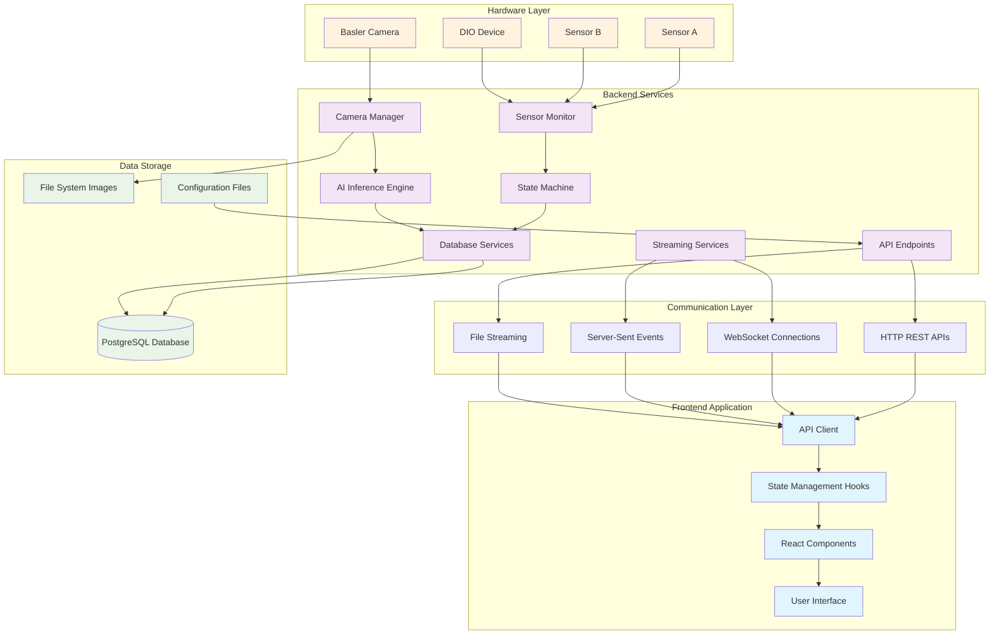
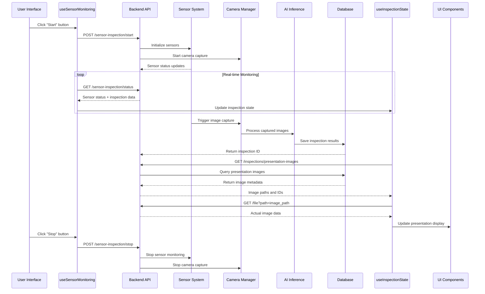
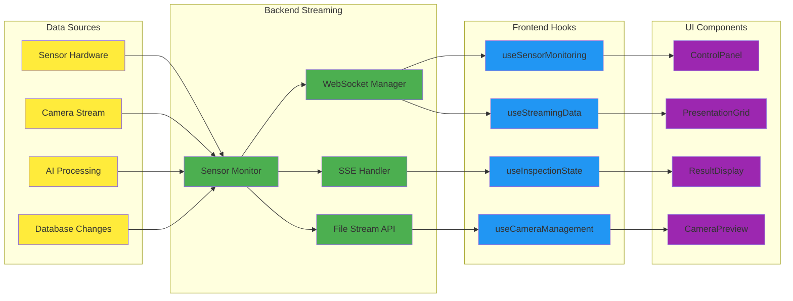
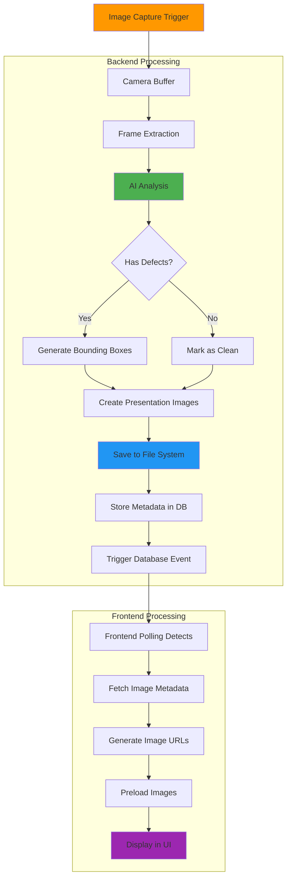
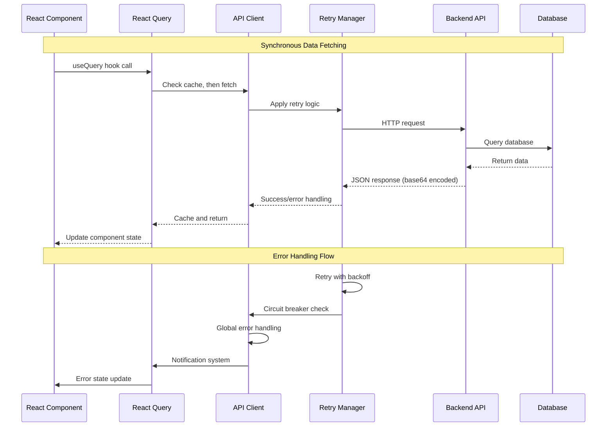
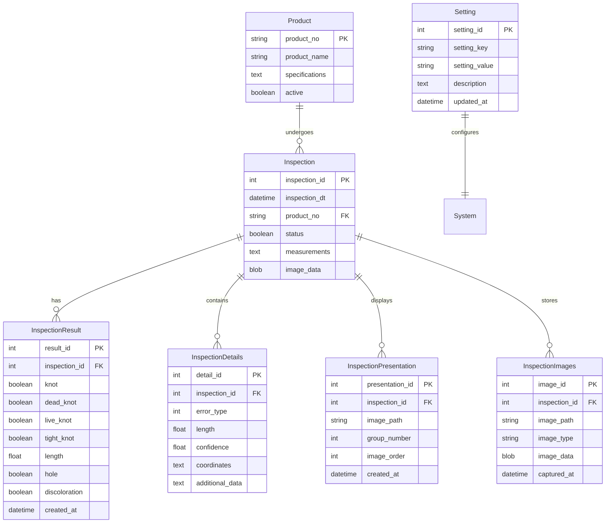
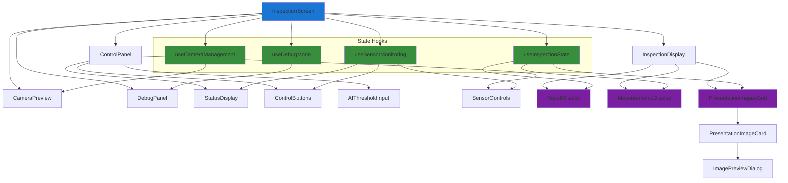
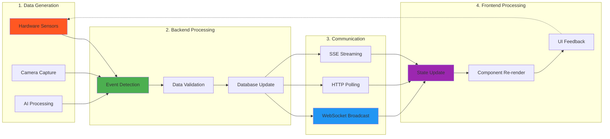
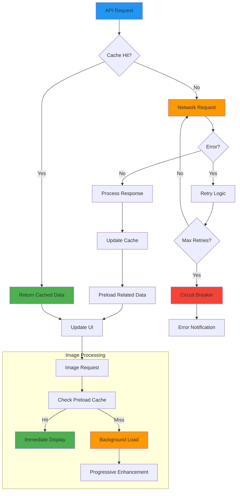
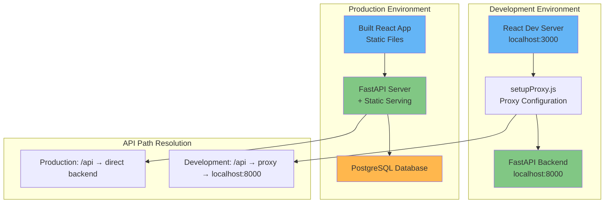

# Data Flow Diagrams - Wood Inspection System

## 🔄 System Data Flow Overview

This document provides comprehensive diagrams illustrating how data flows through the Wood Inspection System, from hardware sensors to user interface display.

## 📊 High-Level System Architecture



## 🔍 Inspection Process Flow



## 🎯 Real-time Data Streaming



## 📸 Image Processing Pipeline



## 🔄 State Management Data Flow

```mermaid
graph TB
    subgraph "Frontend State Management"
        A[useInspectionState]
        B[useSensorMonitoring]
        C[useSensorData]
        D[useCameraManagement]
    end
    
    subgraph "Shared State"
        E[Inspection Results]
        F[Sensor Status]
        G[Presentation Images]
        H[Camera State]
    end
    
    subgraph "Backend APIs"
        I[/api/inspections/latest]
        J[/api/sensor-inspection/status]
        K[/api/inspections/presentation-images]
        L[/api/camera/preview]
    end
    
    subgraph "UI Components"
        M[InspectionScreen]
        N[ControlPanel]
        O[ResultDisplay]
        P[PresentationGrid]
        Q[CameraPreview]
    end
    
    A --> E
    B --> F
    C --> E
    D --> H
    
    A --> G
    
    E --> I
    F --> J
    G --> K
    H --> L
    
    I --> A
    J --> B
    K --> A
    L --> D
    
    A --> M
    B --> N
    A --> O
    A --> P
    D --> Q
    
    style A fill:#e1f5fe
    style B fill:#e1f5fe
    style C fill:#e1f5fe
    style D fill:#e1f5fe
    style E fill:#f3e5f5
    style F fill:#f3e5f5
    style G fill:#f3e5f5
    style H fill:#f3e5f5
    style I fill:#e8f5e8
    style J fill:#e8f5e8
    style K fill:#e8f5e8
    style L fill:#e8f5e8
```

## 🔌 API Communication Patterns



## 📊 Database Schema Relationships



## 🎨 Frontend Component Data Flow



## 🔄 Real-time Update Cycle



## ⚡ Performance Optimization Flow



## 🔧 Development Data Flow



---

*These diagrams provide a visual representation of the complete data flow architecture. For implementation details, refer to the [System Architecture](./SYSTEM_ARCHITECTURE.md) and [Frontend Integration Guide](./FRONTEND_INTEGRATION.md).*