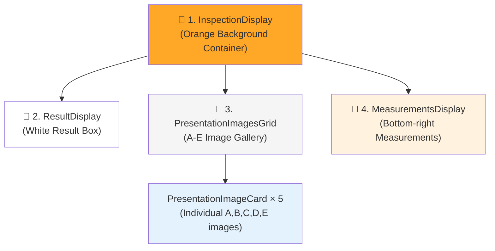
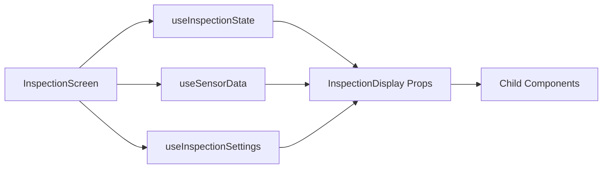

# Inspection Display Components - Architecture & Data Flow Analysis

## 📊 Overview

This document provides a comprehensive analysis of the inspection display components in the Wood Inspection System, detailing how they map to UI elements, their data sources, and architectural patterns including identified conflicts and solutions.

## 🎯 Component-to-UI Mapping

Based on the inspection interface, here's how the React components map to the visual elements:

### **🔴 Component Mapping Diagram**



### **📍 Detailed Component Mapping**

| UI Element | Component | File Location | Responsibility |
|------------|-----------|---------------|----------------|
| **🔴 1** | `InspectionDisplay` | [InspectionDisplay.tsx](../src/app/routes/app/inspection/components/inspection-display/InspectionDisplay.tsx) | Main container with dynamic background color |
| **🔴 2** | `ResultDisplay` | [ResultDisplay.tsx](../src/app/routes/app/inspection/components/inspection-display/ResultDisplay.tsx) | Inspection result display ("こぶし", "節あり", etc.) |
| **🔴 3** | `PresentationImagesGrid` | [PresentationImagesGrid.tsx](../src/app/routes/app/inspection/components/inspection-display/PresentationImagesGrid.tsx) | A-E image gallery with detail button |
| **🔴 4** | `MeasurementsDisplay` | [MeasurementsDisplay.tsx](../src/app/routes/app/inspection/components/inspection-display/MeasurementsDisplay.tsx) | Measurement values ("歩出し 20 mm") |

## 🏗️ Component Architecture

### **Hierarchical Structure**

### Stop Behavior and Data Flow (Clarified)

- When the user presses "■ 停止":
  - The backend monitoring is stopped via `/sensor-inspection/stop`.
  - The UI status moves to `待機中` because monitoring is inactive.
  - If there is a current in-flight inspection (the one that just finished capturing), the UI will only finish loading data for that inspection ID:
    - Triggers presentation-image loading for that specific ID.
    - Fetches the detailed result for that same ID.
  - The system does not look up or restore any older/previous inspection from the database.
  - Existing results already visible on screen are not cleared; no duplicated fetching paths are used.

This ensures single-press Stop ends monitoring immediately while still allowing the most recent, in-progress inspection to complete rendering. No historical result hydration occurs.

```typescript
InspectionScreen (Parent)
└── InspectionDisplay (Container)
    ├── ResultDisplay (Inspection Results)
    ├── PresentationImagesGrid (Image Gallery)
    │   └── PresentationImageCard × 5 (Individual Images)
    └── MeasurementsDisplay (Measurement Values)
```

### **Component Props Interface**

```typescript
// InspectionDisplay Props
interface InspectionDisplayProps {
  inspectionResult: string;           // "無欠点", "こぶし", "節あり"
  defectType: string;                // "穴発生", "変色発生", etc.
  measurements: string;              // Measurement data
  presentationImages: PresentationImage[];  // Image metadata
  loadingPresentationImages: boolean; // Loading state
  createdInspectionId: number | null; // Current inspection ID
  onShowDetail: (id: number) => void; // Detail modal callback
  onImageTest?: (path: string, inspectionId?: number) => void;
}
```

## 📊 Data Flow Analysis

### **1. InspectionDisplay - Main Container**

**Data Sources:**
- **Props from Parent**: All data comes from [InspectionScreen](../src/app/routes/app/inspection/InspectionScreen.tsx)
- **Background Color Logic**: Dynamic based on inspection result

```typescript
// Background color calculation
const backgroundColorClass = useMemo(() => {
  if (!inspectionResult) return 'bg-gray-300';     // No result
  if (inspectionResult === '無欠点') return 'bg-green-500';   // No defects
  if (inspectionResult === 'こぶし') return 'bg-yellow-500';  // Small knot
  return 'bg-red-500';                            // Large knot (節あり)
}, [inspectionResult]);
```

**Data Flow:**


### **2. ResultDisplay - Inspection Results**

**⚠️ CRITICAL: Multiple Data Sources Conflict**

**Current Data Sources (PROBLEMATIC):**
1. **useSensorData Hook** - Real-time sensor processing
2. **Props from Parent** - Database-sourced results
3. **Global Window State** - `window.sensorStatus`
4. **Direct API Calls** - `/sensor-inspection/status`

```typescript
// CONFLICT: Multiple data sources in ResultDisplay
const { batchResult, defectType: sensorDefectType } = useSensorData();
const { inspectionResult, defectType: propDefectType } = props;

// CONFLICT: Different processing logic for same data
useEffect(() => {
  if (sensorBatchResult) {
    setDisplayResult(sensorBatchResult);     // From sensor hook
  } else {
    setDisplayResult(null);                  // Clear if no sensor data
  }
}, [sensorBatchResult]);

// CONFLICT: Global state override
const sensorStatus = (window as any).sensorStatus;
if (sensorStatus?.inspection_results) {
  setInspectionResults(sensorStatus.inspection_results);
}
```

**Architecture Violation:**
This violates the **Database-First Architecture** specification which requires:
- ❌ Use only database sources for inspection results
- ❌ Disable sensor data processing that can override database results
- ❌ Remove useSensorData dependency from ResultDisplay

### **3. PresentationImagesGrid - Image Gallery**

**Data Sources:**
- **Props Only**: `presentationImages` from parent
- **No Conflicts**: Single, clear data source

```typescript
// Clean data flow - no conflicts
const PresentationImagesGrid: React.FC<PresentationImagesGridProps> = ({ 
  presentationImages,
  loading,
  onImageTest
}) => {
  // Process images by group (A, B, C, D, E)
  const groupsToShow = useMemo(() => {
    return availableGroups.length > 0
      ? allGroups.slice(0, availableGroups.length)
      : allGroups;
  }, [availableGroups, allGroups]);
```

**Image URL Generation:**
```typescript
// Each image uses utility function for URL generation
const imageUrl = getImageUrl(imagePath, inspectionId);

// Multiple fallback strategies:
// 1. Direct path: /api/file?path=src-api/data/images/inspection/...
// 2. Date folder: /api/file?path=.../YYYYMMDD_HHMM/filename
// 3. Filename only: /api/file?path=filename
```

### **4. MeasurementsDisplay - Measurement Values**

**Data Sources:**
- **useInspectionSettings Hook**: Configuration-based calculations
- **Props**: Inspection result for calculation logic

```typescript
// Clean calculation logic
const measurementValue = useMemo(() => {
  if (!settings || !inspectionResult) return '';
  
  const value = getMeasurementForDefectType(defectType || '', inspectionResult);
  return value;
}, [settings, defectType, inspectionResult, getMeasurementForDefectType]);

// Mapping logic in useInspectionSettings:
// 無欠点 → no_defect (45mm)
// こぶし → small_knot (45mm)  
// 節あり → large_knot (45mm)
```

## 🚨 Identified Data Conflicts

### **Priority 1: ResultDisplay Architecture Violation**

**Problem:**
- Multiple data sources creating inconsistent results
- Sensor data overriding database results
- Violates database-first architecture specification

**Current Conflicting Sources:**
```typescript
// ❌ CONFLICT 1: Multiple hooks for same data
const { batchResult } = useSensorData();           // Real-time processing
const { inspectionResult } = props;                // Database results

// ❌ CONFLICT 2: Different timing
useSensorData: 1-second polling
useInspectionState: 2-second global state checking
ResultDisplay: Real-time window state monitoring

// ❌ CONFLICT 3: Race conditions
- Sensor data can override database results
- Multiple state updates for same information
- No clear data source priority
```

### **Solution: Database-First Implementation**

**Recommended Fix:**
```typescript
// ✅ CORRECT: Database-First ResultDisplay
const ResultDisplay: React.FC<ResultDisplayProps> = ({ 
  inspectionResult,    // From database only
  defectType          // From database only
}) => {
  // REMOVE: useSensorData dependency
  // REMOVE: Global state monitoring
  // REMOVE: Multiple data source conflicts
  
  const displayResult = inspectionResult;     // Database-sourced only
  const displayDefectType = defectType;       // Database-sourced only
  
  return (
    <div className="result-display">
      {displayResult && (
        <div className="text-4xl font-bold bg-white text-black">
          {displayResult}
        </div>
      )}
    </div>
  );
};
```

## 📈 Performance Considerations

### **Current Performance Issues**

1. **Multiple Polling Mechanisms:**
   - useSensorData: 1-second intervals
   - useInspectionState: 2-second intervals  
   - ResultDisplay: Continuous global state monitoring

2. **Data Processing Duplication:**
   - Same inspection_results processed in multiple hooks
   - Redundant defect type calculations
   - Unnecessary state synchronization

3. **Memory Leaks:**
   - Multiple interval timers
   - Global state event listeners
   - Uncleared window objects

### **Optimization Recommendations**

1. **Single Data Source:**
   ```typescript
   // Use only database-sourced props
   // Remove real-time sensor data processing
   // Eliminate polling conflicts
   ```

2. **Memoization:**
   ```typescript
   // Existing good practice in MeasurementsDisplay
   const measurementValue = useMemo(() => {
     return getMeasurementForDefectType(defectType, inspectionResult);
   }, [defectType, inspectionResult, getMeasurementForDefectType]);
   ```

3. **Image Preloading:**
   ```typescript
   // Already implemented in PresentationImageCard
   result.data.forEach((img) => {
     const preloadImg = new Image();
     preloadImg.src = getImageUrl(img.image_path, img.inspection_id);
   });
   ```

## 🔧 Component Responsibilities Matrix

| Component | ✅ Working Correctly | ⚠️ Minor Issues | ❌ Major Problems |
|-----------|---------------------|------------------|------------------|
| **InspectionDisplay** | Container orchestration | - | - |
| **PresentationImagesGrid** | Single data source, clear flow | Image loading fallbacks | - |
| **MeasurementsDisplay** | Settings-based calculation | - | - |
| **PresentationImageCard** | URL generation, error handling | - | - |
| **ResultDisplay** | - | - | Multiple data sources, architecture violation |

## 🎯 Action Items

### **Immediate (High Priority)**
1. **Fix ResultDisplay Architecture Violation**
   - Remove useSensorData dependency
   - Use only database-sourced props
   - Eliminate sensor data processing conflicts

2. **Implement Database-First Pattern**
   - Update data flow to use single source
   - Remove real-time sensor overrides
   - Ensure consistent display results

### **Medium Priority**
3. **Performance Optimization**
   - Consolidate polling mechanisms
   - Implement proper cleanup
   - Add React.memo where beneficial

4. **Error Handling Enhancement**
   - Improve image loading fallbacks
   - Add component error boundaries
   - Handle API failure scenarios

### **Low Priority**
5. **Code Quality**
   - Add comprehensive TypeScript types
   - Implement unit tests
   - Document component interfaces

## 📚 Related Documentation

- [System Architecture](./SYSTEM_ARCHITECTURE.md) - Overall system design
- [API Documentation](./API_DOCUMENTATION.md) - Backend endpoints reference
- [Frontend Integration](./FRONTEND_INTEGRATION.md) - React integration patterns
- [Data Flow Diagrams](./DATA_FLOW_DIAGRAMS.md) - Visual data flow maps

## 🔍 Technical Specifications

### **Technology Stack**
- **React 18.3.1** with TypeScript
- **Tailwind CSS** for styling
- **React Query** for data fetching
- **Custom Hooks** for state management

### **Key Dependencies**
- `useInspectionState` - Database results management
- `useSensorData` - Real-time sensor processing (problematic)
- `useInspectionSettings` - Configuration management
- `getImageUrl` - Image URL generation utility

### **Performance Metrics**
- Image preloading for smooth UX
- Memoized calculations to prevent re-renders
- Debounced polling to reduce API load
- Circuit breaker patterns for error handling

---

*This document provides a comprehensive analysis of the inspection display components. For implementation details and code changes, refer to the individual component files and related documentation.*